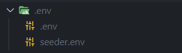

 <h1>BUPD</h1> 

<b>A modern fullstack police application for BUPD</b>

 

  
  
  

- [Packages](#packages)
- [Requirements](#requirements)
- [Steps](#steps)
  - [Environment Variables](#environment-variables)
- [Workflow](#workflow)
- [Deployments](#deployments)
- [Shared dependencies](#shared-dependencies)
- [Contributors](#contributors)

## Packages

This monorepo contains the following packages:-

- [**`@bupd/client`**](https://github.com/Devorein/bupd/tree/staging/packages/client): Next.js client package for BUPD
- [**`@bupd/seeder`**](https://github.com/Devorein/bupd/tree/staging/packages/seeder): Database seeder package for BUPD
- [**`@bupd/server`**](https://github.com/Devorein/bupd/tree/staging/packages/server) : Node.js Express server package for BUPD
- [**`@bupd/types`**](https://github.com/Devorein/bupd/tree/staging/packages/types) : Typescript type definition package for BUPD
- [**`@bupd/validation`**](https://github.com/Devorein/bupd/tree/staging/packages/validation) : Payload validation package for BUPD
- [**`@bupd/constants`**](https://github.com/Devorein/bupd/tree/staging/packages/constants) : Shared constants package

## Requirements

1. Make sure you have at least node 14 install
2. Run `node -v` and check the version
3. If its less than `14` go [here](https://nodejs.org/en/download/) to download the required version
4. You can also use [nvm](https://github.com/coreybutler/nvm-windows) to maintain multiple node versions in your system
5. Check if `npm` is installed using `npm -v` (It should be installed along side node.js)

## Steps

1. Run `npm install` to install shared dependencies
2. Run `npm run bootstrap` to install package dependencies and symlink binaries
3. Run `npm run build` to build all packages except the client using `typescript`
4. Run `npm run lint` to lint all packages using `eslint`
5. Run `npm run test` to run tests for all packages using `jest`

### Environment Variables

Before proceeding further please make sure you create the `.env` files

1. Create a `.env` **folder** in root directory
2. Create two files `seeder.env` and `.env` there
3. Inside `seeder.env` store these variables
   1. `ADMIN_PASSWORD`: Password of admin user
   2. `ADMIN_EMAIL`: Email of admin user
4. Inside `.env` store these variables
   1. `DATABASE_PASSWORD`: Mysql database password
   2. `DATABASE_USER`: Mysql Database user
   3. `DATABASE_HOST`: Mysql database host
   4. `DATABASE_NAME`: Mysql database name
   5. `SERVER_PORT`: Express server port
   6. `PASSWORD_SALT`: Password salt used when hashing
   7. `JWT_SECRET`: Jwt secret

A sample `.env` directory

## Workflow

We tried to maintain a specific git workflow in this project.

1. Only repository owner has push access to `prod` and `staging` branches
2. Every member must create a branch from `staging` to work on their tasks
3. Once they've completed their task they push to the same remote branch.
4. From there they need to create a PR to the `staging` branch and add other members to review it
5. Two github workflows will run when a PR is sent to `staging` branch
   1. First workflow lints, builds and tests the code
   2. Second workflow creates a preview deployment to vercel
6. If the reviewer leaves any comments to be further resolved, the member must resolve those.
7. Once everything's been resolved, the reviewer will merge the PR to `staging` branch.
8. After an accumulation of commits to `staging` branch, the owner will create a PR from `staging` to `prod` branch
9. This will trigger one github workflow
   1. Automated server deployment to our `digitalocean droplet`
   2. Automated client deployment to our `vercel` project.

## Deployments

- `server`: Our [server](https://api.bupd.xyz) is deployed on a digitalocean droplet
- `client`: Our [client](https://bupd.xyz) is deployed on a vercel hobby plan project

**NOTE**: We are hosting our database on the same droplet as the server

## Shared dependencies

We are using a few shared dependencies across the monorepo to avoid installing same npm packages multiple times

1. `tsc`: typescript compiler
2. `jest`: Javascript test runner
3. `eslint`: Javascript/Typescript linter
4. `del-cli`: Package to delete directories
5. `nodemon`: Package to automatically restart node process
6. `lerna`: Javascript framework to maintain multi-package repositories (monorepo)

## Contributors

1.  Safwan Shaheer [devorein](https://github.com/Devorein) Backend, Frontend, Devops, Testing, System Design, Documentation, ER & Schema Design
2.  Zayed Humayun [abystoma](https://github.com/abystoma) Backend, Testing, Documentation, ER & Schema Design
3.  Rafid Hamid [xImouto](https://github.com/xImouto) Backend, Testing, Documentation, ER & Schema Design
4.  Rakinul Haque [rakinulhaque](https://github.com/rakinulhaque) Backend, ER & Schema Design, Documentation
5.  Abrar Awsaf [ShababKabab](https://github.com/ShababKabab) Backend, ER & Schema Design, Documentation
